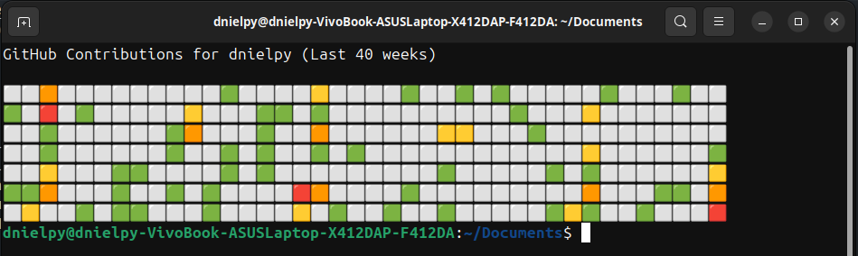

# 🟩 GitHub Contributions in Terminal

Visualize your latest GitHub contributions right in the terminal — with emoji-powered heatmaps!  
This simple Bash script fetches your GitHub activity and displays it horizontally, week by week.

---

## 📸 Preview

  
<!-- Replace with your actual screenshot path -->

---

## 🚀 Features

- 🖥️ Terminal-only — no GUI required
- 🔥 Colorful contribution graph (like GitHub!)
- 🌐 Fetches live data from your GitHub profile
- 📆 Customizable number of weeks
- 💡 Lightweight and easy to modify

---

## 🛠️ Installation

Clone the repository:

```bash
git clone https://github.com/dnielpy/git-heatmap-cli.git
cd git-heatmap-cli
chmod +x script.sh
